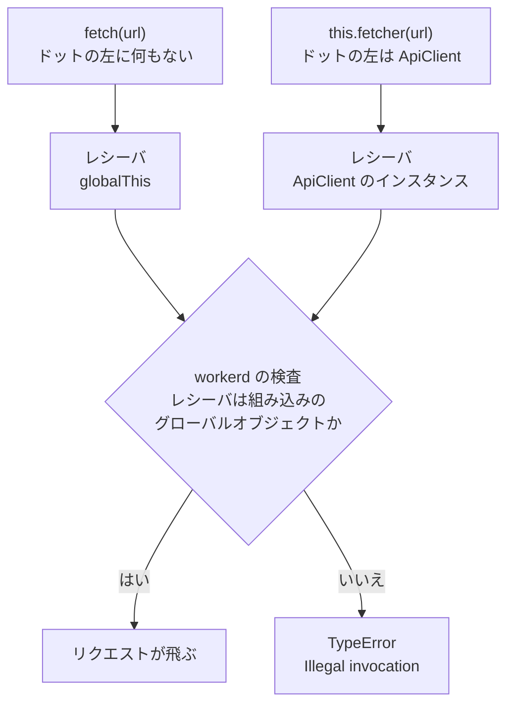

テストのときだけ `fetch` を差し替えたくて、リクエストを送信するクラスに fetch を外から渡せる引数を追加しました。呼び出し側が何も渡さなければ、本物の fetch をそのまま使います。

```ts
constructor(fetcher: Fetcher = fetch) {
  this.fetcher = fetcher;
}
```

ローカルでは動いていたのに、Cloudflare Workers へデプロイすると失敗しました。

```plaintext
TypeError: Illegal invocation: function called with incorrect `this` reference.
See https://developers.cloudflare.com/workers/observability/errors/#illegal-invocation-errors for details.
```

エラーになるかどうかは、fetch をどこから呼ぶかで決まります。クラスのフィールドに入れて `this.fetcher(url)` と書くと、Cloudflare Workers では処理が失敗します。この記事では、8 通りの呼び出し方を 1 つの Worker で試して、エラーになる条件を切り分けました。

## fetch を差し替えられるようにしたクライアント

失敗したコードから、通信に関わる部分だけを抜き出しました。

```ts src/client.ts
type Fetcher = (
  input: RequestInfo | URL,
  init?: RequestInit,
) => Promise<Response>;

export class ApiClient {
  private readonly fetcher: Fetcher;

  constructor(fetcher: Fetcher = fetch) {
    this.fetcher = fetcher;
  }

  async getStatus(url: string): Promise<number> {
    const response = await this.fetcher(url);
    return response.status;
  }
}
```

テストでは偽の fetcher を渡し、本番では何も渡さずに本物の fetch を使う形です。外から差し替えられるようにする書き方としてよくあるもので、TypeScript の型としても正しく通ります。

このクライアントを Workers 上で `new ApiClient().getStatus(url)` と呼ぶと、`this.fetcher(url)` の行で先ほどの Illegal invocation になります。

## 落ちる呼び方と落ちない呼び方

fetch を保持したから落ちるのか、それとも別の条件があるのかを確かめました。1 つの Worker の中で 8 通りの呼び方を試します。

```ts src/index.ts
import { ApiClient } from './client';

const TARGET_URL = 'https://example.com/';

async function run(label: string, task: () => Promise<number>) {
  try {
    return { label, ok: true, status: await task() };
  } catch (error) {
    return {
      label,
      ok: false,
      name: error instanceof Error ? error.name : typeof error,
      message: error instanceof Error ? error.message : String(error),
    };
  }
}

export default {
  async fetch(): Promise<Response> {
    const bare = fetch;

    const results = await Promise.all([
      run('globalThis の fetch をそのまま呼ぶ', async () => (await fetch(TARGET_URL)).status),
      run('ローカル変数に代入して呼ぶ', async () => (await bare(TARGET_URL)).status),
      run('クラスのフィールドに保持して呼ぶ', () => new ApiClient(fetch).getStatus(TARGET_URL)),
      run('bind(globalThis) してから保持する', () =>
        new ApiClient(fetch.bind(globalThis)).getStatus(TARGET_URL),
      ),
      run('関数で包んでから保持する', () =>
        new ApiClient((input, init) => fetch(input, init)).getStatus(TARGET_URL),
      ),
      run('this に undefined を渡す', async () => (await bare.call(undefined, TARGET_URL)).status),
      run('this に globalThis を渡す', async () => (await bare.call(globalThis, TARGET_URL)).status),
      run('this に空のオブジェクトを渡す', async () => (await bare.call({}, TARGET_URL)).status),
    ]);

    return Response.json(results);
  },
};
```

`bunx wrangler dev` で起動して `http://localhost:8787/` を開くと、8 通りの結果が JSON で返却されます。`https://example.com/` へのリクエストで、結果は次のとおりでした。

| 呼び方 | workerd | bun |
|---|---|---|
| `fetch(url)` | 200 | 200 |
| `const bare = fetch; bare(url)` | 200 | 200 |
| クラスのフィールドに保持して `this.fetcher(url)` | Illegal invocation | 200 |
| `fetch.bind(globalThis)` を保持 | 200 | 200 |
| `(input, init) => fetch(input, init)` を保持 | 200 | 200 |
| `bare.call(undefined, url)` | 200 | 200 |
| `bare.call(globalThis, url)` | 200 | 200 |
| `bare.call({}, url)` | Illegal invocation | 200 |

落ちたのは 8 通りのうち 2 通りだけです。しかも `const bare = fetch` は通っています。つまり、fetch を変数へ入れたことが原因ではありません。落ちた 2 つに共通するのは、fetch を呼ぶときの this がグローバルオブジェクト以外になっている点です。

## this が何になるかは呼び方で決まる

fetch の中身の this が何になるかは、関数をどう書いたかではなく、どう呼んだかで決まります。呼び出しのドットの左側にあるオブジェクトが、その呼び出しでの this です。このドットの左側のオブジェクトをレシーバ[^receiver]と呼びます。



`fetcher = fetch` と書いた時点では、まだ何も起きていません。関数への参照が 1 つコピーされただけです。落ちるのは、その参照をプロパティに置き、`this.fetcher(url)` という形で呼んだときです。この形はレシーバが ApiClient のインスタンスになるため、fetch は自分と無関係なオブジェクトを this として受け取ります。

`const bare = fetch; bare(url)` がエラーにならないのは、この呼び方だとレシーバが存在せず、this がグローバルオブジェクトとして扱われるからです。実測でも `call(undefined)` と `call(globalThis)` は同じく 200 でした。変数へ代入して呼ぶだけの試し方では、この失敗は起きません。

## workerd がレシーバを確かめる理由

Workers の fetch は、JavaScript で書かれた関数ではありません。Workers を動かしているランタイムの workerd は C++ で実装されていて、fetch や caches などのグローバル API は C++ のオブジェクトのメソッドとして JavaScript へ公開されています。コードは、メソッドを V8 の FunctionTemplate として登録するときに Signature を一緒に渡していました([resource.h](https://github.com/cloudflare/workerd/blob/main/src/workerd/jsg/resource.h) から引用)。

```cpp src/workerd/jsg/resource.h
prototype->Set(isolate, name,
    v8::FunctionTemplate::New(isolate,
        &MethodCallback<TypeWrapper, name, isContext, Self, decltype(method),
            method, ArgumentIndexes<decltype(method)>>::callback,
        v8::Local<v8::Value>(), signature, length, v8::ConstructorBehavior::kThrow));
```

私は C++ を書けないので、ここは [V8 の API ドキュメント](https://v8.github.io/api/head/classv8_1_1Signature.html)を読んだ範囲での理解です。
そこには「A Signature specifies which receiver is valid for a function.(Signature はその関数にとって正しいレシーバがどれかを決める)」とあります。レシーバがその指定に合わない呼び出しは、C++ 側の実体を取り出す前に V8 が TypeError として拒否する形です。fetch はグローバルオブジェクトのメソッドとして登録されているため、レシーバがグローバルオブジェクトから離れると条件を外れます。

V8 が出すこのエラーの文面は、本来 Illegal invocation の 1 行だけです。workerd は V8 にパッチを当てて、ドキュメントの URL を付け足していました。

```diff patches/v8/0012-Update-illegal-invocation-error-message-in-v8.patch
-  T(IllegalInvocation, "Illegal invocation")                                   \
+  T(IllegalInvocation,                                                         \
+    "Illegal invocation: function called with incorrect `this` reference. "    \
+    "See "                                                                     \
+    "https://developers.cloudflare.com/workers/observability/errors/"          \
+    "#illegal-invocation-errors for details.")                                 \
```

このおかげで、エラーの文面から [Errors and exceptions](https://developers.cloudflare.com/workers/observability/errors/#illegal-invocation-errors) へそのままたどり着けます。公式が挙げている例は ctx の分割代入でした。

```js
export default {
    async fetch(request, env, ctx) {
        // destructuring ctx makes waitUntil lose its 'this' reference
        const { waitUntil } = ctx;
        // waitUntil errors, as it has no 'this'
        waitUntil(somePromise);

        return fetch(request);
    },
};
```

今回起きたのは、取り出した関数を別のオブジェクトのプロパティへ置いたときに落ちる形でした。どちらもレシーバが本来のオブジェクトから離れる点は同じです。回避方法として公式が挙げているのは、直接呼ぶか、bind・call・apply で元のオブジェクトへ結び直すことです。

## ローカルの bun での挙動

同じモジュールを bun で実行すると、8 通りすべてが 200 になりました。失敗は 0 件です。

bun の fetch は JavaScript のランタイムが用意する普通の関数で、レシーバを見ていないと考えられます。理由はどうあれ、手元での確認を bun だけで済ませると、この失敗は最後まで見つかりません。Workers 向けのコードは、`wrangler dev` で一度動かすまで確認が終わらない、と考えたほうが安全です。

## 直し方

修正は 1 行です。何も渡されなかったときに使う fetcher を、レシーバがグローバルオブジェクトのまま動く関数へ変更します。

```diff src/client.ts
  constructor(
-   fetcher: Fetcher = fetch,
+   // Workers の fetch はレシーバが globalThis 以外だと呼び出せないため、関数で包む
+   fetcher: Fetcher = (input, init) => fetch(input, init),
  ) {
    this.fetcher = fetcher;
  }
```

`fetch.bind(globalThis)` と書いても結果は同じで、実測ではどちらも 200 でした。

## まとめ

- Cloudflare Workers で Illegal invocation が出る条件は、組み込みの API を呼ぶときのレシーバがグローバルオブジェクト以外になっていること
- `const bare = fetch` のような変数への代入だけでは落ちない。落ちるのは、その関数を別のオブジェクトのプロパティに置き、`obj.method()` の形で呼んだとき
- workerd の組み込み API は C++ オブジェクトのメソッドとして公開されており、呼び出しのたびにレシーバの型が確かめられる
- 直し方は `fetch.bind(globalThis)` か `(input, init) => fetch(input, init)` のどちらかで、実測ではどちらも動く
- bun では 8 通りの呼び方すべてが成功する。Workers 向けのコードは `wrangler dev` まで動かして確認する

## 参考

- [Errors and exceptions · Cloudflare Workers docs](https://developers.cloudflare.com/workers/observability/errors/#illegal-invocation-errors)
- [cloudflare/workerd — src/workerd/jsg/resource.h](https://github.com/cloudflare/workerd/blob/main/src/workerd/jsg/resource.h)
- [V8 API ドキュメント — v8::Signature](https://v8.github.io/api/head/classv8_1_1Signature.html)
- [cloudflare/workerd — patches/v8/0012-Update-illegal-invocation-error-message-in-v8.patch](https://github.com/cloudflare/workerd/blob/main/patches/v8/0012-Update-illegal-invocation-error-message-in-v8.patch)

[^receiver]: 「メソッド呼び出しを受け取る側のオブジェクト」という意味です。仕様の用語ではありませんが、`this` になるオブジェクトを指す言い方として広く使われています。
